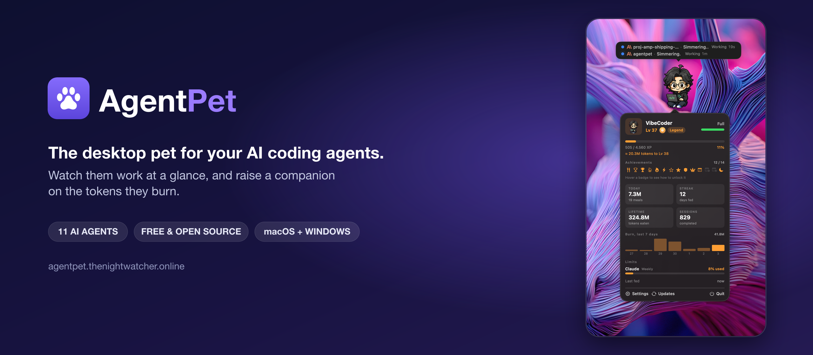

<div align="center">
  
  <p>
    <a href="https://trendshift.io/repositories/46602?utm_source=trendshift-badge&amp;utm_medium=badge&amp;utm_campaign=badge-trendshift-46602" target="_blank" rel="noopener noreferrer"></a>
  </p>
  <p>
    
    
    
    <a href="https://github.com/ntd4996/agentpet/actions"></a>
    <a href="https://github.com/ntd4996/agentpet"></a>
  </p>
  <p><b>A desktop pet that reacts while your AI coding agents work , and grows the more you code.</b></p>
  <p>
    <a href="https://agentpet.thenightwatcher.online">Website</a> ·
    <a href="https://agentpet.thenightwatcher.online/install">Install</a> ·
    <a href="https://agentpet.thenightwatcher.online/gallery">Pet gallery</a> ·
    <a href="https://agentpet.thenightwatcher.online/leaderboard">Leaderboard</a> ·
    <a href="https://discord.gg/kzFJKsZav">Discord</a>
  </p>
  <p><b>If AgentPet brightens your workflow, please <a href="https://github.com/ntd4996/agentpet">give it a star</a> , it genuinely helps others find it.</b></p>
  <p>
    <b>English</b> ·
    <a href="docs/readme/README.vi.md">Tiếng Việt</a> ·
    <a href="docs/readme/README.zh-Hans.md">简体中文</a> ·
    <a href="docs/readme/README.ja.md">日本語</a>
  </p>
</div>

---

Run several coding agents at once (Claude Code, Codex, Gemini, Cursor and more) and it gets hard to tell who is **working**, who is **done**, and who is **waiting for your input**. AgentPet answers that at a glance: a menu-bar monitor shows every agent's live state, and a little pixel pet floats on your desktop and reacts to it all.

It is also a **tamagotchi**. The pet is fed by real work , the tokens your agents burn and the sessions they finish , so it earns XP, levels up, unlocks achievements, and evolves as you code. Free, open source, and fully offline unless you choose to connect.

## Table of contents

- [Highlights](#highlights)
- [Features](#features)
- [Supported agents](#supported-agents)
- [Screenshots](#screenshots)
- [Install](#install)
- [Getting started](#getting-started)
- [Usage dashboard](#usage-dashboard)
- [Pets](#pets)
- [Platforms](#platforms)
- [Community ports](#community-ports)
- [Contributors](#contributors)
- [Acknowledgements](#acknowledgements)
- [Support](#support)
- [License](#license)

## Highlights

- 🐾 **Ambient desktop pet** that mirrors your agents' state without breaking your focus.
- 📊 **Menu-bar monitor** with every agent, its project, what it's doing, and a live timer.
- 🎮 **Raise your pet**: real tokens and finished sessions feed it, level it up, and unlock 14 achievements.
- 🗂️ **Per-project pets** and a **per-project token usage dashboard** (daily and monthly).
- 🔌 **11 coding agents** supported out of the box, plus a universal wrapper for anything else.
- ☁️ **Optional web profile, leaderboard, and cross-device restore** , everything works offline if you skip it.
- 🌍 **Localized** in English, Tiếng Việt, 简体中文 and 繁體中文.
- 🍎 **macOS** (native Swift/SwiftUI, notarized) and 🪟 **Windows** (Tauri), both with auto-update.

## Features

**Monitor your agents**

- **Multi-agent monitor** in the menu bar: a live list of every agent with a colored status dot, the project, what it's doing (running tool / reason it's waiting), and a per-state timer counting in real time.
- **At-a-glance icon**: shows how many agents are running, and turns **orange with a count** when one needs your input.
- **Native notifications** when an agent finishes or asks for input, with sounds you can toggle.
- **Reactive, themed speech bubbles** per agent, with a model badge, plus fully custom messages and appearance if you want them.
- **Session history**: the last 90 days of sessions are kept locally so you can look back.

**Raise your companion (tamagotchi)**

- Your pet eats the **real tokens your agents burn** and the **sessions they finish** (including subagents). It earns XP, levels up, and evolves through five stages: Hatchling → Companion → Scout → Hero → Legend.
- **Every pet keeps its own level**, so the more you code with a companion, the more it grows.
- **14 achievements** from real milestones: first session, level-ups, token burns (1M / 10M / 50M), session counts, feeding streaks, a Night Owl badge, and more.
- **Stats HUD**: right-click the pet for a game-style card , level, XP, hunger, a 7-day burn chart, your streak, and your live **Claude / Codex subscription limits read directly from your sign-ins** (no extra tool needed).
- **Break reminder** (off by default) nudges you to step away after long stretches.

**Work across projects**

- **Per-project pets**: assign a companion to a project folder, and that project's XP goes to it.
- **Split pet**: configured projects get their own on-screen pet; everything else shares your main one.
- **Usage dashboard**: see exactly where your tokens go, per project and per agent, day by day and month by month (see below).

**Share and sync (all optional)**

- **Web profile & leaderboard**: sign in with GitHub to show your companions at [agentpet.thenightwatcher.online](https://agentpet.thenightwatcher.online/profile) and climb the community [leaderboard](https://agentpet.thenightwatcher.online/leaderboard) by level, sessions, or tokens.
- **Cross-device restore**: sign in on a second machine (or after a fresh install) and your pets come back at the level you raised them. Progress merges forward only, so it is never undone on either machine.
- **Community pet gallery**: browse thousands of pets, adopt one in a click, submit your own, and request new ones.

AgentPet runs completely offline. Connecting only adds the web profile, leaderboard and cross-device sync , nothing leaves your machine until you sign in.

## Supported agents

Install a hook from **Settings** with one click, or wrap any command.

| Agent | State detail |
| --- | --- |
| Claude Code, Codex, Gemini CLI, opencode, Factory Droid | working · **waiting for input** · done |
| Cursor, Windsurf, Antigravity, GitHub Copilot, Kiro CLI, Pi | working · done |
| GLM (Z.AI) | works through Claude Code automatically |
| **Anything else** | `agentpet run -- <command>` , working while it runs, done when it exits |

## Screenshots

<div align="center">
  
  <p><sub><b>Right-click the pet</b> for a game-style HUD , level, XP, hunger, a 7-day burn chart and your live Claude/Codex limits.</sub></p>
</div>

<table align="center">
  <tr>
    <td align="center" width="50%"><br/><sub>Menu-bar monitor , every agent at a glance</sub></td>
    <td align="center" width="50%"><br/><sub>Care tab , raise your pet with real work</sub></td>
  </tr>
  <tr>
    <td align="center" width="50%"><br/><sub>Native, tabbed Settings</sub></td>
    <td align="center" width="50%"><br/><sub>The desktop pet</sub></td>
  </tr>
</table>

<div align="center">
  <br/>
  
  <p><sub>Community <a href="https://agentpet.thenightwatcher.online/leaderboard">leaderboard</a> , by level, sessions or tokens.</sub></p>
  
</div>

## Install

### macOS , Homebrew

```bash
brew install --cask ntd4996/tap/agentpet
```

### macOS , direct download

Grab the latest `AgentPet.dmg` from [Releases](https://github.com/ntd4996/agentpet/releases/latest), open it, and drag AgentPet to Applications. Builds are Developer ID-signed and notarized by Apple, so they open without a Gatekeeper warning, and update themselves via the menu-bar **Updates** button.

### Windows

Download the installer or portable build from the [website](https://agentpet.thenightwatcher.online/install) or the [releases](https://github.com/ntd4996/agentpet/releases). The first launch may show a SmartScreen warning (the Windows build isn't code-signed yet); click **More info → Run anyway**. It installs per-user (no admin) and auto-updates.

### Build from source (macOS)

```bash
git clone https://github.com/ntd4996/agentpet.git
cd agentpet
./scripts/build-app.sh release
open build/AgentPet.app
```

Requires Xcode 16 / Swift 6. The Windows app lives under [`windows/`](windows/) (Tauri + Rust).

## Getting started

1. Launch AgentPet , it lives in the menu bar.
2. Open **Settings → General** and click **Install** next to Claude Code (or your agent), then **Enable** notifications.
3. Run an agent. The pet reacts, and the menu-bar icon shows who is working or waiting.
4. (Optional) Open **Settings → Care → Sign in with GitHub** to sync your companions and unlock the web profile, leaderboard and cross-device restore.

### Uninstall

1. In **Settings → General**, click **Remove** next to each connected agent (this strips AgentPet's hooks so the agents don't error after the app is gone).
2. Remove the app and its data:

```bash
brew uninstall --cask agentpet          # or drag /Applications/AgentPet.app to Trash
rm -rf ~/.agentpet                        # downloaded pets + local state
rm -f  ~/Library/Preferences/com.agentpet.app.plist
```

## Usage dashboard

Sign in and open the **Usage dashboard** (in your profile menu on the website) to see where your tokens actually go:

- **By project and by agent**, so you can tell which repo and which model is burning the most.
- **Daily and monthly** views, with a chart and per-project / per-agent breakdowns.
- Only the **last folder name** of each project is ever sent, never the full path, and nothing is logged until you connect.

Admins get a community-wide view plus a per-user drill-down.

## Pets

Pets use the open Codex pet-pack format (`pet.json` + a spritesheet). You can:

- **Browse** the online library and adopt a pet in one click (Settings → Pet → Browse pets, or the [web gallery](https://agentpet.thenightwatcher.online/gallery)).
- **Map animations** to states, resize, rename, and customise chat lines.
- **Make your own** and [submit it](https://agentpet.thenightwatcher.online/submit) to the community gallery.

A starter pet is installed on first launch. **AgentPet bundles no pet art** , every pack is added at runtime, and each asset is owned by its submitter under their own license.

## Platforms

- **macOS 13 Ventura or later** , native Swift / SwiftUI, notarized, Sparkle auto-update, Homebrew cask. Apple Silicon and Intel.
- **Windows 10 / 11 (64-bit)** , Tauri (Rust), auto-update. Feature parity with macOS.

Under the hood: a Unix-socket daemon receives agent events from lightweight hooks, an on-device store drives the pet, and an optional Astro + Cloudflare Workers/D1 backend powers the web profile, leaderboard and usage dashboard. See [`docs/specs`](docs/specs) for the design.

## Community ports

AgentPet is built for macOS and Windows, but the community has reimagined it elsewhere:

- **Linux (Rust + GTK4)** , [agentpet-linux](https://github.com/tranhuuhuy297/agentpet-linux) by [@tranhuuhuy297](https://github.com/tranhuuhuy297). An independent, from-scratch port for Ubuntu (Claude Code + Codex).

These are separate community projects, not maintained here. Building one? Open an issue and we'll link it.

## Contributors

AgentPet is a community effort. Huge thanks to everyone who has shipped code, pets, translations and ports , see the full [Hall of Fame](https://agentpet.thenightwatcher.online/contributors).

- **[@ntd4996](https://github.com/ntd4996)** , creator and maintainer
- **[@hoangphison](https://github.com/hoangphison)** , co-founder
- ...and many more contributors on the [website](https://agentpet.thenightwatcher.online/contributors) and in the repo's [contributors list](https://github.com/ntd4996/agentpet/graphs/contributors).

Contributions are welcome , features, agent integrations, pets, translations and bug fixes. Open an issue or a pull request.

## Acknowledgements

AgentPet stands on the shoulders of an open community.

- **The idea and the pet-pack format come from [Petdex](https://github.com/crafter-station/petdex)** (MIT). AgentPet is an independent, interoperable client: it reads packs in Petdex's format and can adopt them from Petdex's public API.
- **The pets themselves are the community's.** The gallery mirrors thousands of companions from **Petdex** and **OpenPets**, alongside pets **submitted directly by AgentPet users**. Every pet asset is owned by its respective creator under their own license.
- **Contributors and community ports** (above) shaped much of what AgentPet is today.

AgentPet bundles no pet art of its own. If you hold rights to a character and want it removed, please see our [takedown page](https://agentpet.thenightwatcher.online/legal), and for pets sourced from Petdex, direct takedowns there.

## Support

If AgentPet saves you some tab-hunting:

- ⭐ **[Star the repo](https://github.com/ntd4996/agentpet)** so more people find it.
- ☕ **[Buy me a coffee](https://buymeacoffee.com/ntd4996)** to fuel more features.

Built by **[Nguyễn Thành Đạt (@ntd4996)](https://github.com/ntd4996)** and the community.

## License

MIT , see [LICENSE](LICENSE). Application code only; pet assets are not part of this repository and belong to their respective creators.
